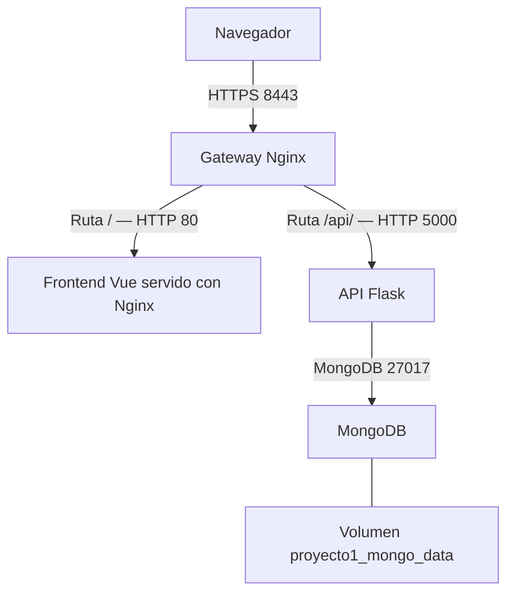

# proyecto_1_1006323_paula_ximena_navarro_ruano

**Estudiante:** Paula Ximena Navarro Ruano  
**Carné:** 1006323  
**Curso:** Virtualización  
**Aplicación:** Mi Súper — Inventario de productos de supermercado

## Descripción

Aplicación para crear, consultar, actualizar y eliminar productos.
Cada producto contiene nombre, precio y stock.

La solución utiliza cuatro contenedores independientes administrados
con Docker Compose. El acceso desde el navegador se realiza mediante
un gateway Nginx con HTTPS.

## Tecnologías

- Vue 3, TypeScript, HTML y CSS. TypeScript se compila a JavaScript.
- Vite para generar la versión de producción.
- Node.js 22 Alpine durante la construcción del frontend.
- Nginx Alpine para servir el frontend y como gateway.
- Python 3.13, Flask 3.1.2 y PyMongo 4.15.1.
- MongoDB 8.0.
- Docker, Docker Compose, red bridge y volumen nombrado.
- OpenSSL para generar el certificado autofirmado.

## Requisitos

- Docker Desktop iniciado con contenedores Linux.
- Docker Compose con soporte para `--wait`.
- Git Bash, Git, OpenSSL y curl.
- Internet para descargar imágenes y dependencias.
- Puertos 8082 y 8443 disponibles con la configuración inicial.

Python y Node.js no necesitan instalarse en el host para ejecutar
la solución mediante Docker.

## Arquitectura



Vue solicita `/api/productos` al mismo origen utilizado por el navegador.
Nginx dirige esa solicitud a Flask y Flask accede a MongoDB.

HTTPS termina en el gateway. Los enlaces internos hacia el frontend
y el backend utilizan HTTP dentro de la red Docker.

## Servicios y direccionamiento inicial

| Servicio | Contenedor | IP fija | Puerto interno | Función |
|---|---|---|---|---|
| gateway | proyecto1-gateway | 192.168.162.12 | 80 y 443 | Entrada HTTP/HTTPS y proxy |
| frontend | proyecto1-frontend | 192.168.162.13 | 80 | Interfaz compilada |
| backend | proyecto1-backend | 192.168.162.14 | 5000 | API REST |
| mongodb | mongodb | 192.168.162.15 | 27017 | Almacenamiento |

Solo el gateway publica puertos en el host:
`127.0.0.1:8082` y `127.0.0.1:8443`.

MongoDB, backend y frontend no publican puertos hacia el host.
Los valores de IP y de los puertos configurables se definen en `.env`.

## Estructura de directorios

- `backend/`: app.py, requirements.txt y Dockerfile.
- `frontend/`: código Vue, recursos, configuración y Dockerfile.
- `nginx/nginx.conf.template`: plantilla activa del gateway.
- `nginx/nginx.conf`: configuración anterior, no montada por el Compose actual.
- `nginx/certs/`: configuración OpenSSL, certificado y llave local.
- `documentacion/`: documentación técnica en Word y PDF.
- `documentacion/evidencias/`: documentos con las capturas.
- `docker-compose.yml`: servicios, variables, IP, red, volumen y dependencias.
- `.env`: valores locales de configuración.
- `.env.example`: valores de referencia para reconstruir el entorno.
- `.gitignore`: exclusión de archivos locales y respaldos.

## Variables de entorno

Una variable de entorno permite configurar un servicio sin modificar
su lógica. Docker Compose lee `.env` para sustituir `${VARIABLE}`
en su configuración. Solo los valores declarados en `environment`
se pasan al contenedor correspondiente.

Flask obtiene sus valores mediante `os.getenv`.
Nginx genera su configuración desde la plantilla al iniciar.

| Variables | Uso |
|---|---|
| MONGO_HOST, MONGO_PORT, MONGO_DATABASE | Conexión de Flask a MongoDB |
| BACKEND_HOST, BACKEND_PORT | Dirección de escucha y puerto de Flask |
| FLASK_DEBUG | Activa o desactiva la depuración; inicialmente false |
| HOST_BIND_IP, HTTP_PORT, HTTPS_PORT | Publicación del gateway en el host |
| DOCKER_NETWORK_NAME | Nombre de la red externa |
| MONGO_VOLUME_NAME | Nombre del volumen externo |
| NETWORK_SUBNET, NETWORK_GATEWAY | Parámetros para crear la red externa |
| GATEWAY_IP, FRONTEND_IP, BACKEND_IP, MONGODB_IP | IP fijas de los servicios |

`NETWORK_SUBNET` y `NETWORK_GATEWAY` se utilizan durante la creación
de la red; cambiar `.env` no modifica una red externa existente.

## Red y comunicación

La red bridge externa inicial es `proyecto_network`,
con subred `192.168.162.0/27` y gateway `192.168.162.1`.

Los servicios se comunican mediante resolución de nombres de Docker:
`backend`, `frontend` y `mongodb`.

`localhost` dentro de un contenedor identifica ese mismo contenedor.
Por eso no se utiliza para conectar Flask con MongoDB ni Nginx con Flask.
El healthcheck del backend sí usa localhost porque comprueba el proceso
dentro de su propio contenedor.

## MongoDB y persistencia

- Base de datos: `proyecto1_db`.
- Colección: `productos`.
- Campos: `_id`, `nombre`, `precio` y `stock`.
- La API convierte `_id` en una cadena llamada `id`.
- Volumen externo: `proyecto1_mongo_data`.
- Punto de montaje: `/data/db`.

El volumen conserva los datos cuando se eliminan y recrean los
contenedores. Clonar el código en otra computadora no copia esos datos.

## Nginx y HTTPS

La imagen oficial procesa `nginx/nginx.conf.template` y genera
`/etc/nginx/conf.d/default.conf`.

- El puerto interno 80 redirige al puerto HTTPS definido en `.env`.
- El puerto interno 443 utiliza TLS.
- `/` apunta a `frontend:80`.
- `/api/` apunta a `backend` con el puerto definido en `.env`.
- El proxy conserva la ruta `/api/productos`.

Nginx utiliza `/etc/nginx/certs/server.crt` y
`/etc/nginx/certs/server.key`.

El certificado identifica al servidor y contiene su llave pública.
La llave privada permite al servidor demostrar que posee la identidad
asociada al certificado durante TLS.

El certificado es autofirmado, por lo que el navegador puede advertir
que no pertenece a una autoridad de confianza. HTTPS cifra el tráfico;
HTTP no proporciona ese cifrado.

## Instalación y construcción

Clonar el repositorio personal:

```bash
git clone https://github.com/IsPau04/proyecto_1_1006323_paula_ximena_navarro_ruano.git
cd proyecto_1_1006323_paula_ximena_navarro_ruano
```

Si se descarga el repositorio del curso, entrar en la subcarpeta
`proyecto_1_1006323_paula_ximena_navarro_ruano`.

Crear `.env` si todavía no existe y cargar sus valores en Git Bash:

```bash
cp -n .env.example .env
set -a
source .env
set +a
```

Consultar los recursos existentes:

```bash
docker network ls
docker volume ls
```

Si no existen, crearlos:

```bash
docker network create --driver bridge \
  --subnet "$NETWORK_SUBNET" \
  --gateway "$NETWORK_GATEWAY" \
  "$DOCKER_NETWORK_NAME"

docker volume create "$MONGO_VOLUME_NAME"
```

Si la red ya existe, verificar que sus parámetros coincidan:

```bash
docker network inspect "$DOCKER_NETWORK_NAME"
```

Las IP fijas deben pertenecer a esa subred y esta no debe superponerse
con otras redes del equipo.

## Generación del certificado

Desde la raíz del proyecto:

```bash
openssl req \
  -config nginx/certs/openssl.cnf \
  -x509 -nodes -days 365 -newkey rsa:2048 -sha256 \
  -keyout nginx/certs/server.key \
  -out nginx/certs/server.crt
```

El comando genera una llave RSA de 2048 bits y un certificado
autofirmado válido durante 365 días. `-config` selecciona la configuración
del proyecto; `-nodes` deja la llave sin contraseña para el arranque local.

Si ya existen un certificado vigente y su llave correspondiente,
no es necesario regenerarlos.

```bash
openssl x509 -in nginx/certs/server.crt \
  -noout -subject -dates -ext subjectAltName
```

`.env` y las llaves privadas permanecen excluidos del repositorio.

## Construir y levantar

```bash
docker compose config --quiet
docker compose up -d --build --wait
docker compose ps
docker images
```

`config` valida la configuración. `up` crea e inicia los servicios,
`-d` los ejecuta en segundo plano, `--build` construye las imágenes
y `--wait` espera su disponibilidad.

Los Dockerfiles producen `proyecto1-backend:1.0` y
`proyecto1-frontend:1.0`. El frontend ejecuta `npm run build`
y sirve los archivos resultantes con Nginx.

Con los valores iniciales, abrir https://localhost:8443.

## Detener y reconstruir

Detener y eliminar los contenedores:

```bash
docker compose down
```

Reconstruir después de modificar el código:

```bash
docker compose up -d --build --wait
```

La red y el volumen externos se conservan al ejecutar `down`.

## API REST

| Método | Ruta | Operación | Respuesta normal |
|---|---|---|---|
| GET | /api/productos | Listar productos | 200 |
| GET | /api/productos/id | Consultar uno | 200 |
| POST | /api/productos | Crear | 201 |
| PUT | /api/productos/id | Actualizar | 200 |
| DELETE | /api/productos/id | Eliminar | 200 |

POST recibe nombre, precio y stock en JSON. PUT recibe los campos
que se desean actualizar. Hay respuestas básicas 400 para solicitudes
inválidas y 404 para productos inexistentes.

## Pruebas realizadas

Se comprobó el CRUD desde Vue, el almacenamiento en MongoDB,
la persistencia después de recrear contenedores, la redirección HTTP,
el acceso HTTPS, la configuración de Nginx y las variables del backend.

Comandos de revisión con la configuración inicial:

```bash
docker compose ps
docker images
docker network inspect proyecto_network
docker volume inspect proyecto1_mongo_data
docker compose logs --tail=100 backend gateway
docker compose exec gateway nginx -t
curl -I http://localhost:8082
curl --cacert nginx/certs/server.crt -i https://localhost:8443/api/productos
```

## Prueba de CRUD y persistencia

1. Crear un producto desde Vue.
2. Consultarlo y modificar su stock.
3. Ejecutar `docker compose down`.
4. Ejecutar `docker compose up -d --wait`.
5. Recargar Vue y comprobar que el producto conserva sus valores.
6. Eliminarlo desde Vue y comprobar que desaparece.

Las capturas y explicaciones se encuentran en `documentacion/`.

## Problemas encontrados y soluciones

| Problema | Solución aplicada |
|---|---|
| Puerto 8080 ocupado | Utilizar 8082 para HTTP y 8443 para HTTPS |
| OpenSSL no encontraba su configuración | Indicar el archivo mediante `-config` |
| Gateway montaba archivos de la carpeta antigua | Recrear los servicios desde la carpeta final |
| Llave privada sin exclusión | Agregar `nginx/certs/*.key` a `.gitignore` |
| Git Bash convertía rutas Linux a Windows | Usar `MSYS_NO_PATHCONV=1` en el comando afectado |
| Puertos y direcciones escritos directamente | Incorporar variables y una plantilla de Nginx |

Para consultar la configuración generada desde Git Bash:

```bash
MSYS_NO_PATHCONV=1 docker compose exec gateway cat /etc/nginx/conf.d/default.conf
```

## Alcance

Proyecto académico para ejecución local. MongoDB no configura
autenticación y Flask utiliza su servidor integrado dentro de Docker,
con depuración desactivada. No está preparado como despliegue público
de producción.